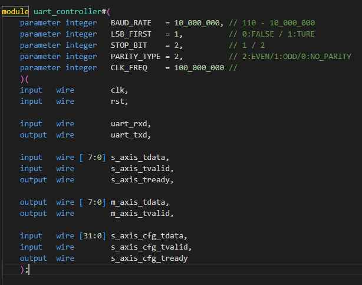

# README
## UART_Controller
这是一个标准串口控制模块，使用Verilog发送和接受串口数据。

## UART控制器设计方案简要说明

### 系统框图

### 模块端口定义如下：

#### 参数：
1.	波特率 : 10 - 10_000_000
2.	大小端
3.	停止位
4.	校验位
5.	时钟频率（考虑时钟频率在程序运行中不可变，所以不做动态可配置）

#### 动态可配置(位宽为32bit)：
1.	波特率：24bit
2.	大小端:  1bit
3.	停止位:  2bit
4.	校验位:  2bit
5.	通道开启与关闭：1bit
6.	3bit保留位

#### 参数配置地址如下：
 

### 波特率误差：
因为波特率由总时钟分频而来，所以分频系数必须是整数。如果实际要求的波特率需要总时钟的分频系数不为整数，就会产生波特率误差。
误差率=（总时钟/分频系数-波特率）/ 波特率。
当误差率大于一定值（1%）就会导致数据错误。
如果输入的总时钟频率为100MHz，那么1M及以上的波特率就需要考虑波特率误差。

有两种解决方案：
1.	调用模块时根据需要波特率，人为更改输入总时钟，保证分频系数为整数；
2.	设计波特率生成模块，计算波特率误差，然后在分频时，弥补误差。

弥补误差的方法
以波特率为8M举例，所需要的分频系数为12.5，实际为12。此时波特率误差为4.16%。会导致数据出错。弥补的方法是。分频计数一次计数12，一次计数13，交替进行。就能弥补误差。

### 波特率发生器
实际上是一个分频模块。一般来讲，为了提高系统的容错性，要求波特率发生器的输出时钟为实际串口数据波特率的N倍，N可以取值为8、16、32、64。但是在（1MHz）以及更高的频率时，就无法做到N倍波特率的输出。所以这里直接输出波特率上升沿（位周期开始，发送端）与下降沿（位周期中点，接收端）的标志信号。

为了保证模块的波特率可调范围达到110-10000000，且波特率误差不会导致错误数据。这里使用了对频率的计数器。涉及一个对32位宽数据比较大小的组合逻辑。如果在调用模块到工程后时序不收敛，需要根据实际的波特率和时钟频率对这个计数器化简一下。
针对毛刺
打开校验码，如果校验码有错，这个字节的数据不会有效。

如果有进一步过滤毛刺的需要：
1.	将通道开启信号默认值更改为关闭。
2.	在位周期中部，采样四次，确保不是毛刺。（对打拍后的串口信号再次缓存，在波特率ce使能时，检测缓存的四个数据是否一致。如果不一致，在完整采集这一个字节的比特后，无效这个字节的数据）

### 回环测试：
自发自收，直接将uart_rx 与 uart_tx相连即可。

自收自发，不能将接收到的数据端口m_axis_tdata与m_axis_tvalid 直接输入给发送端的端口s_axis_tdata和s_axis_tvalid。发送一个字节数据需要保证停止位发送完整，而接收一个字节的数据则不需要考虑完整接收所有停止位。所以发送要比接收使用更长的时间，需要考虑s_axis_tready是否为高。所以需要寄存器暂存接收到的数据，如下代码所示，源代码在测试文件中。
 

